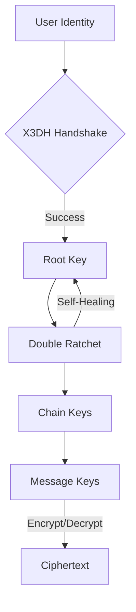

<p align="center">
  
</p>

<h1 align="center">Sibna Protocol (v6.1.0)</h1>

<p align="center">
  <strong>Secure E2EE Protocol v6 — High-assurance messaging kernel.</strong>
</p>

<p align="center">
  <a href="https://opensource.org/licenses/Apache-2.0"></a>
  <a href="https://www.rust-lang.org/"></a>
  
  
</p>

---

## 💎 The Engineering Behind Absolute Privacy

Sibna is a reference messaging kernel written in memory-safe Rust. It handles the complex mathematics of **X3DH** and **Double Ratchet**, providing a production-ready core for secure messaging applications.

### Key Pillars
- 🛡️ **Post-Compromise Security**: Self-healing cryptographic state machine.
- ⚡ **High Performance**: Rust-native core with zero-cost abstractions.
- 📦 **Multi-Language**: Optimized bindings for Python, Flutter, C++, and Web.
- 🔐 **Zero-Knowledge**: Relay servers never touch plaintext or metadata.

---

## 🏗️ Architecture Overview

The Sibna Kernel manages the entire lifecycle of a secure session, from initial handshake to continuous re-keying.



---

## 🚀 Quick Start (SDKs)

### 🐍 Python SDK
```bash
pip install https://github.com/F2fX4553/sibna_protocol_v6/archive/refs/tags/v6.1.0.tar.gz
```

### 💙 Flutter / Dart SDK
Add to `pubspec.yaml`:
```yaml
dependencies:
  sibna_dart:
    git:
      url: https://github.com/F2fX4553/sibna_protocol_v6.git
      path: sibna-dart
```

### ⚡ JavaScript / Web (React/Vue/Next.js)
```bash
npm install https://github.com/F2fX4553/sibna_protocol_v6.git#sibna-js
```

### ⚙️ C++ (CMake)
Add to your `CMakeLists.txt`:
```cmake
FetchContent_Declare(
  sibna
  GIT_REPOSITORY https://github.com/F2fX4553/sibna_protocol_v6.git
  GIT_TAG v6.1.0
)
FetchContent_MakeAvailable(sibna)
```

---

## 💻 Technical Usage

### JavaScript Example
```javascript
import { SecureContext } from 'sibna-js';

const ctx = new SecureContext({ password: 'master_key' });
const ciphertext = await ctx.encrypt('peer_id', 'Secret Message');
```

### C++ Example
```cpp
#include <sibna/sibna.hpp>

auto ctx = sibna::SecureContext(config, "master_key");
auto ciphertext = ctx.encrypt_message("peer_id", "High-Assurance Truth");
```

---

## 🧪 Cryptographic Specification

| Primitive | Implementation | Purpose |
| :--- | :--- | :--- |
| **Key Agreement** | X25519 (Curve25519) | Diffie-Hellman Exchange |
| **Authentication** | Ed25519 | Identity Signatures |
| **Encryption** | ChaCha20-Poly1305 | AEAD Authenticated Data |
| **Hashing** | HMAC-SHA256 / BLAKE3 | KDF & Chain Management |

---

## 📚 Resources

- 📖 **[Technical Whitepaper](docs/whitepaper.md)**: Cryptographic proofs and specifications.
- 🛠️ **[Developer Guide](DEVELOPER_GUIDE.md)**: Building and contributing.
- 🌐 **[Encyclopedia](web/encyclopedia.html)**: Deep-dive into protocol internals.
- 🚀 **[Deployment](DEPLOYMENT.md)**: Scaling the Relay server.

---

<p align="center">
  Made with ❤️ for Secure Communication<br>
  <strong>Sibna Core Team</strong>
</p>
