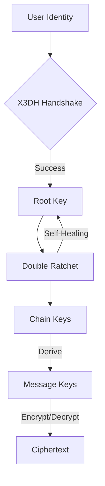

<p align="center">
  
</p>

<h1 align="center">Sibna Protocol (v6.1.0)</h1>

<p align="center">
  <strong>Secure E2EE Protocol v6 — High-assurance messaging kernel.</strong>
</p>

<p align="center">
  <a href="https://opensource.org/licenses/Apache-2.0"></a>
  <a href="https://www.rust-lang.org/"></a>
  
</p>

---

## 💎 The Engineering Behind Absolute Privacy

Sibna is a reference messaging kernel written in memory-safe Rust. It handles the complex mathematics of **X3DH** (Extended Triple Diffie-Hellman) and **Double Ratchet**, providing a production-ready core for secure messaging applications.

### Key Pillars
- 🛡️ **Post-Compromise Security**: Self-healing cryptographic state machine.
- ⚡ **High Performance**: Rust-native core with zero-cost abstractions.
- 📦 **Multi-Language**: Optimized bindings for Python, Flutter, JavaScript, and C++.
- 🔐 **Zero-Knowledge**: Relay servers never touch plaintext or metadata.

---

## 🏗️ Architecture Overview

The Sibna Kernel manages the entire lifecycle of a secure session, from initial handshake to continuous re-keying.



---

## 🛡️ Security Architecture

Sibna is built on a **Double Ratchet** core, ensuring that every message increases the security entropy of the session.

- **Self-Healing**: The session recovers automatically from temporary device compromise.
- **Persistence & OpSec**:
  - **Encrypted Storage**: Local state (keys, sessions, indices) is persisted in a password-derived encryption layer.
  - **Memory Safety**: Sensitive materials are cleared immediately after use via the `zeroize` crate.
- **Forward Secrecy**: Historical messages cannot be decrypted even if current long-term keys are stolen.

---

## 🚀 The SDK Ecosystem: Advanced Usage

Sibna follows a **Shared Core Architecture**. Below are professional-grade implementation examples for production environments.

### � Python SDK: Enterprise Integration
Professional usage involving persistent state and asynchronous message handling.
```python
from sibna import SecureContext, Config, StorageAdapter

# 1. Initialize with persistent encrypted storage
config = Config(storage_path="./vault", db_encryption=True)
ctx = SecureContext(config, password=b"argon2_derived_secret")

# 2. X3DH Pre-key management
bundle = ctx.generate_prekey_bundle()
# upload_to_server(bundle)

# 3. Asymmetric encryption with automatic ratchet refresh
session = ctx.get_or_create_session(peer_id="alice_99")
ciphertext = session.encrypt(b"Confidential Engineering Report")
```

### 💙 Flutter SDK: Mobile-First Security
Using `sibna_dart` with secure background sync and stream-based decryption.
```dart
import 'package:sibna_dart/sibna_dart.dart';

Future<void> initSecureMessenger() async {
  final ctx = SecureContext(Config(), password: "user_biometric_key");
  
  // Handling incoming encrypted stream
  messagingSource.stream.listen((payload) async {
    final plaintext = await ctx.decrypt(payload.senderId, payload.data);
    updateUI(plaintext);
  });
}
```

### ⚡ JavaScript SDK: Web-Worker Isolation
Ideal for privacy-focused web apps using worker threads to isolate crypto logic.
```javascript
import { SibnaKernel } from 'sibna-js';

// Instantiate within a Web Worker for maximum OpSec
const kernel = new SibnaKernel();
await kernel.initialize({ engine: 'wasm', masterKey: '...' });

const blob = await kernel.processIncomingMessage(senderId, encryptedBlob);
console.log('Decrypted in-worker:', blob.toString());
```

---

## 🏗️ SDK Engineering: Building New Bindings

Developers can extend Sibna to any language. The "One Core, Many Faces" model ensures cryptographic parity.

1.  **Shared Kernel (Rust)**: All logic is in `/core`.
2.  **FFI Bridge**: We export a standard C89-compatible ABI.
    ```bash
    cd core && cargo build --target x86_64-unknown-linux-gnu
    ```
3.  **Generating Headers**: Create `sibna.h` to see the available C entry points.
    ```bash
    cbindgen --config cbindgen.toml --output sibna.h
    ```
4.  **Binding Strategy**:
    - **Wrappers**: Map C pointers to Object-Oriented classes (e.g., `PyObject` for Python, `JSObject` for Node).
    - **Memory**: Use your language's Garbage Collector hooks or destructors to call `sibna_free()` in Rust, preventing memory leaks of sensitive keys.

---

## 🧪 Cryptographic Specification

| Primitive | Implementation | Purpose |
| :--- | :--- | :--- |
| **X3DH** | X25519 & Ed25519 | Mutual Authentication & Key Exchange |
| **Ratchet** | HMAC-SHA256 | Symmetrical Key Evolution |
| **AEAD** | ChaCha20-Poly1305 | Authenticated Encryption |
| **Storage** | AES-256-GCM (SIV) | Encrypted Local Persistence |

---

## 📚 Resources

📖 **[Whitepaper](docs/whitepaper.md)** | 🌐 **[Encyclopedia](web/encyclopedia.html)** | 🛠️ **[Dev Guide](DEVELOPER_GUIDE.md)**

---

<p align="center">
  Made with ❤️ for Secure Communication by the <strong>Sibna Core Team</strong>
</p>
