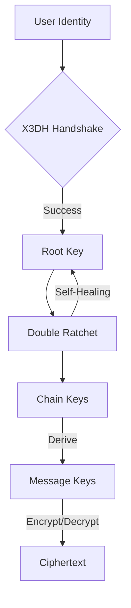

<p align="center">
  
</p>

<h1 align="center">Sibna Protocol (v6.1.0)</h1>

<p align="center">
  <strong>Secure E2EE Protocol v6 — High-assurance messaging kernel.</strong>
</p>

<p align="center">
  <a href="https://opensource.org/licenses/Apache-2.0"></a>
  <a href="https://www.rust-lang.org/"></a>
  
</p>

---

## 💎 The Engineering Behind Absolute Privacy

Sibna is a reference messaging kernel written in memory-safe Rust. It handles the complex mathematics of **X3DH** and **Double Ratchet**, providing a production-ready core for secure messaging applications.

### Key Pillars
- 🛡️ **Post-Compromise Security**: Self-healing cryptographic state machine.
- ⚡ **High Performance**: Rust-native core with zero-cost abstractions.
- 📦 **Multi-Language**: Optimized bindings for Python, Flutter, JavaScript, and C++.
- 🔐 **Zero-Knowledge**: Relay servers never touch plaintext or metadata.

---

## 🏗️ Architecture Overview

The Sibna Kernel manages the entire lifecycle of a secure session, from initial handshake to continuous re-keying.



---

## 🛡️ Security Architecture

Sibna is built on a **Double Ratchet** core, ensuring that every message increases the security entropy of the session.

- **Self-Healing**: The session recovers automatically from temporary device compromise (Post-Compromise Security).
- **Persistence & OpSec**:
  - **Encrypted Storage**: Local state (keys, sessions, indices) is persisted in a password-derived encryption layer.
  - **Memory Safety**: Sensitive materials are cleared immediately after use via the `zeroize` crate.
- **Forward Secrecy**: Historical messages cannot be decrypted even if current long-term keys are stolen.
- **Zero-knowledge Relay**: The relay server manages opaque blobs and never sees unencrypted content.

---

## 🛠️ Developer Onboarding

### 1. Build the Core Engine
The core is written in Rust. You must build it first to generate the necessary libraries.
```bash
cd core
cargo build --release
```

### 2. Verify Protocol Integrity (Testing)
**Rust Unit Tests:**
```bash
cargo test
```

**Full Integration Tests:** (Requires Python 3.12+)
```bash
cd tests
python integration_test_full.py
```

---

## 🚀 The SDK Ecosystem

Sibna follows a **Shared Core Architecture**. The engine is built once in Rust and exposed via a robust FFI layer.

- **Python SDK**: `pip install bindings/python`
- **Flutter / Dart SDK**: Add `sibna_dart` via Git in `pubspec.yaml`.
- **JavaScript SDK**: `npm install sibna-js`
- **C++ SDK**: Integrate using CMake `FetchContent`.

---

## 📂 Repository Layout

| Directory | Content |
| :--- | :--- |
| **`/core`** | Rust-native implementation of the protocol engine. |
| **`/bindings`** | Optimized wrappers for Python and C++. |
| **`/sibna-dart`** | Flutter/Dart SDK for mobile development. |
| **`/sibna-js`** | JavaScript/TypeScript SDK for web apps. |
| **`/docs`** | Whitepaper, API Reference, and Deployment guides. |
| **`/server`** | Reference FastAPI Relay and Pre-Key Server. |

---

## 🏗️ SDK Engineering: Adding New Languages

1.  **Core Kernel**: All cryptographic logic lives in `/core`.
2.  **C-Header Generation**: `cbindgen --config core/cbindgen.toml --output core/sibna.h`
3.  **Language Binding**: Create a wrapper that calls the functions in `sibna.h` via FFI.

---

## 🧪 Cryptographic Specification

| Primitive | Implementation | Purpose |
| :--- | :--- | :--- |
| **Identity** | Ed25519 | Authentication |
| **Key Agreement** | X25519 (Curve25519) | Diffie-Hellman |
| **Encryption** | ChaCha20-Poly1305 | AEAD Encryption |
| **KDF** | BLAKE3 / HKDF-SHA256 | Key Derivation |

---

## 📚 Documentation & Resources

- 📖 **[Whitepaper](docs/whitepaper.md)**: Cryptographic proofs and specs.
- 🌐 **[Encyclopedia](web/encyclopedia.html)**: Deep-dive into protocol internals.
- 🛠️ **[Developer Guide](DEVELOPER_GUIDE.md)**: Building and contributing.
- 🚀 **[Deployment](DEPLOYMENT.md)**: Scaling the Relay server.
- ⚠️ **[Troubleshooting](docs/TROUBLESHOOTING.md)**: Common build and runtime fixes.

---

<p align="center">
  Made with ❤️ for Secure Communication by the <strong>Sibna Core Team</strong>
</p>
