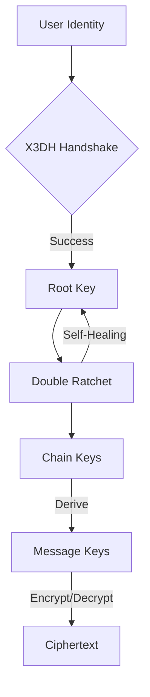

<p align="center">
  
</p>

<h1 align="center">Sibna Protocol (v6.1.0)</h1>

<p align="center">
  <strong>Secure E2EE Protocol v6 — High-assurance messaging kernel.</strong>
</p>

<p align="center">
  <a href="https://opensource.org/licenses/Apache-2.0"></a>
  <a href="https://www.rust-lang.org/"></a>
  
  
</p>

---

## 💎 The Engineering Behind Absolute Privacy

Sibna is a reference messaging kernel written in memory-safe Rust. It handles the complex mathematics of **X3DH** and **Double Ratchet**, providing a production-ready core for secure messaging applications.

### Key Pillars
- 🛡️ **Post-Compromise Security**: Self-healing cryptographic state machine.
- ⚡ **High Performance**: Rust-native core with zero-cost abstractions.
- 📦 **Multi-Language**: Optimized bindings for Python, Flutter, C++, and Web.
- 🔐 **Zero-Knowledge**: Relay servers never touch plaintext or metadata.

---

## 🏗️ Architecture Overview

The Sibna Kernel manages the entire lifecycle of a secure session, from initial handshake to continuous re-keying.



---

## 🚀 The SDK Ecosystem

Sibna is designed to be language-agnostic. The core logic resides in Rust, exposed via a robust FFI layer to multiple platforms.

### 🐍 Python SDK
**Installation:**
```bash
pip install https://github.com/F2fX4553/sibna_protocol_v6.git#subdirectory=bindings/python
```
**Usage:**
```python
from sibna import SecureContext, Config
ctx = SecureContext(Config(), password=b"master_key")
ciphertext = ctx.encrypt_message("peer_id", b"Hello Securely")
```

### 💙 Flutter / Dart SDK
**Installation (pubspec.yaml):**
```yaml
dependencies:
  sibna_dart:
    git:
      url: https://github.com/F2fX4553/sibna_protocol_v6.git
      path: sibna-dart
```
**Usage:**
```dart
import 'package:sibna_dart/sibna_dart.dart';
final ctx = SecureContext(Config(), password: "master_key");
final encrypted = await ctx.encrypt("peer_id", "Hello Flutter");
```

### ⚡ JavaScript / Web (TS)
**Installation:**
```bash
npm install https://github.com/F2fX4553/sibna_protocol_v6.git#sibna-js
```
**Usage:**
```javascript
import { SecureContext } from 'sibna-js';
const ctx = new SecureContext({ password: 'master_key' });
const ciphertext = await ctx.encrypt('peer_id', 'Hello Web');
```

### ⚙️ C++ (CMake)
**Integration:**
```cmake
FetchContent_Declare(sibna GIT_REPOSITORY ... GIT_TAG v6.1.0)
FetchContent_MakeAvailable(sibna)
```
**Usage:**
```cpp
#include <sibna/sibna.hpp>
auto ctx = sibna::SecureContext(config, "master_key");
auto data = ctx.encrypt_message("peer_id", "Hello C++");
```

---

## 🛠️ Building & Extending the SDK

Want to add support for a new language? Sibna uses a layered architecture to make this seamless:

### 1. The Kernel (Rust)
The engine is located in `/core`. It exposes a **C-FFI** (Foreign Function Interface) which is the source of truth for all bindings.

### 2. Generating Bindings
We use `cbindgen` to generate C/C++ headers from the Rust source code:
```bash
cd core
cbindgen --config cbindgen.toml --output sibna.h
```

### 3. Implementing a New SDK
1.  **FFI Interaction**: Use your language's FFI library (e.g., `ctypes` in Python, `dart:ffi` in Dart).
2.  **State Management**: Wrap the raw C pointers in safe, idiomatic objects.
3.  **Security**: Ensure sensitive memory is Zeroized when the object is destroyed.

---

## 🧪 Cryptographic Specification

| Primitive | Implementation | Purpose |
| :--- | :--- | :--- |
| **Identity** | Ed25519 | Authentication |
| **Key Agreement** | X25519 (Curve25519) | Diffie-Hellman |
| **Encryption** | ChaCha20-Poly1305 | AEAD Encryption |
| **KDF** | BLAKE3 / HKDF-SHA256 | Key Derivation |

---

## 📚 Resources

- 📖 **[Whitepaper](docs/whitepaper.md)** | 🌐 **[Encyclopedia](web/encyclopedia.html)** | 🚀 **[Deployment](DEPLOYMENT.md)**

---

<p align="center">
  Made with ❤️ for Secure Communication by the <strong>Sibna Core Team</strong>
</p>
