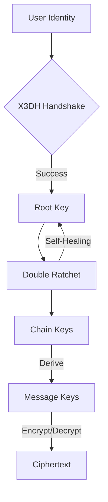

<p align="center">
  
</p>

<h1 align="center">Sibna Protocol (v6.1.0)</h1>

<p align="center">
  <strong>Secure E2EE Protocol v6 — High-assurance messaging kernel.</strong>
</p>

<p align="center">
  <a href="https://opensource.org/licenses/Apache-2.0"></a>
  <a href="https://www.rust-lang.org/"></a>
  
</p>

---

## 💎 The Engineering Behind Absolute Privacy

Sibna is a reference messaging kernel written in memory-safe Rust. It handles the complex mathematics of **X3DH** and **Double Ratchet**, providing a production-ready core for secure messaging applications.

### Key Pillars
- 🛡️ **Post-Compromise Security**: Self-healing cryptographic state machine.
- ⚡ **High Performance**: Rust-native core with zero-cost abstractions.
- 📦 **Multi-Language**: Optimized bindings for Python, Flutter, JavaScript, and C++.
- 🔐 **Zero-Knowledge**: Relay servers never touch plaintext or metadata.

---

## 🏗️ Architecture Overview

The Sibna Kernel manages the entire lifecycle of a secure session, from initial handshake to continuous re-keying.



---

## 🚀 Quick Start: Getting Started

Follow these steps to move from a fresh clone to a functional secure session.

### 1. Build & Verify (Protocol Kernel)
First, ensure the Rust-native core is built correctly.
```bash
# Navigate to the core
cd core
cargo build --release

# Verify the binary is functional
./target/release/sibna_kernel --help
```
> [!NOTE]
> If the help menu appears, the Sibna Kernel is ready for service.

### 2. Verify Protocol Integrity (Testing)
Run the full suite to ensure all cryptographic primitives are operating within specification.

**Rust Unit Tests (Internal State):**
```bash
cargo test --verbose
```
**Expected Result:** `test result: ok. 0 failed; ...`

**Python Integration Tests (End-to-End):**
```bash
cd tests
python integration_test_full.py
```
**Expected Result:** `All tests passed! (Successfully performed X3DH & Double Ratchet)`

---

## 📦 The SDK Ecosystem: Practical Usage

Sibna provides a "Single Source of Truth." Use these examples to implement secure messaging in your application.

### 🐍 Python SDK
**Installation & Usage:**
```bash
pip install ./bindings/python
```
```python
from sibna import SecureContext, Config

# Initialize
ctx = SecureContext(Config(), password=b"master_secret")

# Create Session & Loop
session = ctx.get_or_create_session(peer_id="alice_99")
ciphertext = session.encrypt(b"Hello World")
plaintext = session.decrypt(session.peer_id, ciphertext)

print(f"Decrypted: {plaintext.decode()}") # Expected: Hello World
```

### ⚡ JavaScript SDK (Web)
**Installation & Usage:**
```bash
npm install ./sibna-js
```
```javascript
import { SibnaKernel } from 'sibna-js';

const kernel = new SibnaKernel();
await kernel.initialize({ masterKey: '...' });

const encrypted = await kernel.encryptMessage('alice_99', 'Hello Web');
const decrypted = await kernel.decryptMessage('alice_99', encrypted);

console.log(decrypted); // Expected: Hello Web
```

### 💙 Flutter / Dart SDK
**Add to `pubspec.yaml`:**
```yaml
dependencies:
  sibna_dart:
    git: { url: "...", path: "sibna-dart" }
```
```dart
import 'package:sibna_dart/sibna_dart.dart';

final ctx = SecureContext(Config(), password: "...");
final enc = await ctx.encrypt("peer_id", "Hello Flutter");
final dec = await ctx.decrypt("peer_id", enc);
```

---

## 🏗️ SDK Engineering: Building New Bindings

To add a new language, follow this standardized FFI (Foreign Function Interface) workflow:

### Step 1: Export C-Headers
Generate the bridge from the Rust source to a C-compatible header.
```bash
cargo install cbindgen
cbindgen --config core/cbindgen.toml --output core/sibna.h
```

### Step 2: Implementation Mapping
1.  **Load Library**: Use your language's FFI loader (e.g., `ctypes`, `dart:ffi`) to find the `.so` / `.dll` / `.dylib` generated in `/core/target/release/`.
2.  **Pointer Wrapping**: Map the raw pointers from `sibna.h` to your language's classes.
3.  **Memory Management**: **CRITICAL!** You must implement destructors (or finalizers) that call `sibna_free()` to zeroize and release sensitive key material.

---

## 📂 Repository Layout

| Directory | Content |
| :--- | :--- |
| **`/core`** | Rust-native implementation of the protocol engine. |
| **`/bindings`** | Optimized wrappers for Python and C++. |
| **`/sibna-dart`** | Flutter/Dart SDK for mobile development. |
| **`/sibna-js`** | JavaScript/TypeScript SDK for web apps. |
| **`/server`** | Reference FastAPI Relay and Pre-Key Server. |

---

## 🧪 Cryptographic Specification

| Primitive | Implementation | Purpose |
| :--- | :--- | :--- |
| **Handshake** | X3DH (X25519 & Ed25519) | Authentication & Key Exchange |
| **Ratchet** | Double Ratchet (HMAC-SHA256) | Post-Compromise Security |
| **AEAD** | ChaCha20-Poly1305 | Authenticated Encryption |

---

## 📚 Resources

📖 **[Whitepaper](docs/whitepaper.md)** | 🌐 **[Encyclopedia](web/encyclopedia.html)** | 🛠️ **[Dev Guide](DEVELOPER_GUIDE.md)**

---

<p align="center">
  Made with ❤️ for Secure Communication by the <strong>Sibna Core Team</strong>
</p>
