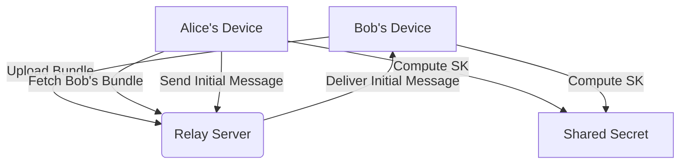
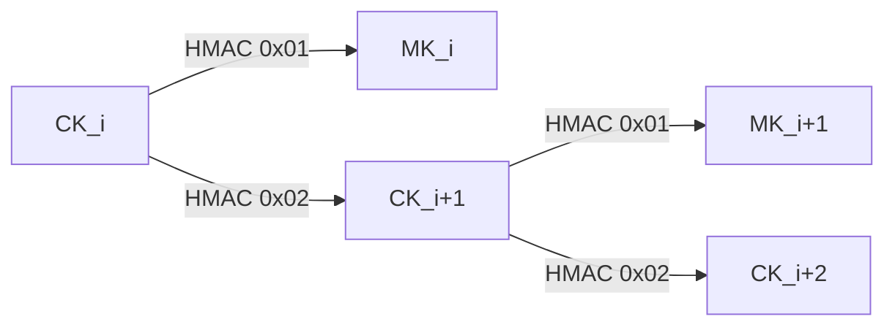
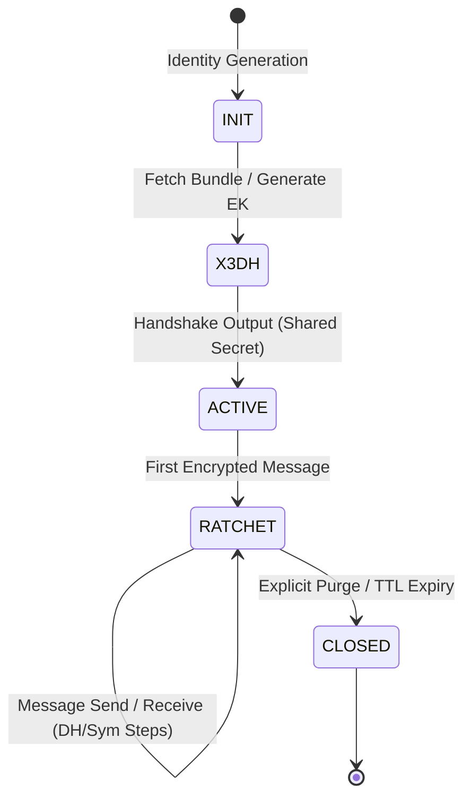

# Sibna Protocol: Technical Manuscript (v2.1.0)
## A Rigorous Specification of X3DH and Double Ratchet Implementation

### 1. Abstract
The Sibna Protocol is a deterministic, high-assurance encryption kernel. It bridges the gap between theoretical cryptographic constructs (Signal Protocol) and practical development by providing a stable, memory-safe Rust core. This document details the mathematical derivation, state machine logic, and byte-level framing of the protocol.

#### 1.1 Security Non-Goals
To maintain a clear threat model, Sibna explicitly defines the following as out-of-scope:
- **Traffic Analysis Resistance**: Sibna does not hide the timing or frequency of messages.
- **Metadata Anonymity**: Sibna does not provide Tor-like anonymity; Relay servers see routing IDs (though not payload contents).
- **Network-Level Obfuscation**: Sibna does not attempt to hide that it is an encrypted messaging protocol from Deep Packet Inspection ($DPI$).

---

### 2. Theoretical Framework
Sibna operates on a **Three-Layer Security Model**:

1.  **Identity Layer**: Ed25519 keys establish permanent, verifiable ownership.
2.  **Agreement Layer (X3DH)**: Bootstrap a shared secret asynchronously using persistent key bundles.
3.  **Communication Layer (Double Ratchet)**: Continuously rotate keys to ensure Forward Secrecy ($FS$) and Post-Compromise Security ($PCS$).

---

### 3. Key Establishment (X3DH Deep-Dive)
Sibna's implementation of Extended Triple Diffie-Hellman ensures that no single key compromise leads to a session breach.

#### 3.1 Pre-Key Bundle Composition
A user's public bundle on the server contains:
- $IK$: Identity Public Key
- $SPK$: Signed Pre-Key Public Key
- $\sigma(SPK, IK)$: SPK Signature
- $\{OPK_1, \dots, OPK_n\}$: List of One-Time Pre-Keys

#### 3.2 Secret Derivation
When Alice ($A$) contacts Bob ($B$), she generates an ephemeral $EK_A$ and calculates:
- $SS = DH(IK_A, SPK_B) \mathbin\| DH(EK_A, IK_B) \mathbin\| DH(EK_A, SPK_B) \mathbin\| DH(EK_A, OPK_B)$

The Root Secret is finalized using **HKDF-SHA256**:
- $RK = HKDF\text{-}Expand(HKDF\text{-}Extract(None, SS), \text{"X3DH_SS"}, 32)$

---

### 4. Continuous Ratcheting Specifications
The Double Ratchet is the "Self-Healing" heart of the protocol.

#### 4.1 Symmetric Key Ratchet (Inner Loop)
Within a single chain, the Chain Key ($CK$) rolls forward using **HMAC-SHA256**:
- **Message Key ($MK$)**: $HMAC(CK, [0x01])$
- **Next Chain Key ($CK'$)**: $HMAC(CK, [0x02])$

This ensures that obtaining any $MK$ does not reveal previous keys or the current $CK$.

#### 4.2 Diffie-Hellman Ratchet (Outer Loop)
Whenever a message is received with a new recipient public key Header is processed:
- $SharedSecret = DH(EK_{local}, EK_{remote})$
- $RK, CK_{recv} = HKDF(RK, SharedSecret, \text{"ratchet_step"})$

#### 4.3 Formal State Machine
The session lifecycle follows a strict transition model to prevent state-injection attacks.

---

### 5. Binary Framing & Packet Structure
Sibna minimizes overhead while maintaining authenticity.

| Offset | Field | Type | Description |
| :--- | :--- | :--- | :--- |
| **0** | `DH_HEADER` | 32B | Sender's current X25519 Public Key |
| **32** | `INDEX` | 8B (u64 LE) | Message count in current symmetric chain |
| **40** | `PREV_INDEX` | 8B (u64 LE) | Count of messages in the previous chain |
| **48** | `NONCE` | 12B | Per-message unique IV for AEAD |
| **60** | `CIPHERTEXT` | Var | ChaCha20-Poly1305 encrypted payload |
| **End** | `TAG` | 16B | Poly1305 Authentication Tag |

Total Overhead: **76 Bytes**.

---

### 6. Security Guarantees & Safeguards

#### 6.1 First Message Authentication (IK Binding)
In Sibna, the first message sent by the Initiator ($A$) is cryptographically bound to their Identity Key ($IK_A$). 
- The $Shared Secret$ ($SS$) derivation includes $DH(IK_A, SPK_B)$. 
- Any attempt to tamper with $IK_A$ in the message metadata will result in a derivation mismatch on the Recipient's side, causing the initial decryption to fail. This binds the ephemeral session to the long-term identity from the first byte. This provides implicit authentication equivalent to Signal’s X3DH identity binding, but does not constitute a standalone signature on the initial ciphertext.

#### 6.2 Replay and Integrity Protection
The protocol maintains a strict window-based tracking system for every session.

| Scenario | Protocol Action | Protection Mechanism |
| :--- | :--- | :--- |
| **Old Packet Replay** | **Reject** | Index verification against `skipped_message_keys`. |
| **Duplicate Packet** | **Reject** | Immediate rejection if index has already been processed. |
| **Window Overflow** | **Failure** | Rejection if message index exceeds the `max_skip` window (Default: 2000). |
| **Auth Tag Tamper** | **Failure** | Poly1305 tag verification failure before any state change. |

---

### 7. Persistence and Memory Hardening
- **Encryption at Rest**: Serialized session states are stored in a password-derived encrypted persistence layer backed by **Sled**. If the device's battery dies or the process is killed, the ratchet state remains consistent.
- **Zeroization**: The `zeroize` crate ensures that all private keys ($IK$, $SPK$, $RK$, $CK$, $MK$) are wiped from RAM immediately after use, mitigating memory-scrape attacks.

---

### 8. Threat Model Summary
| Attack Vector | Status | Mitigation Strategy |
| :--- | :--- | :--- |
| **Passive Eavesdropping** | **Mitigated** | End-to-end encryption using ChaCha20-Poly1305. |
| **Past Key Seizure** | **Mitigated** | Forward Secrecy ($FS$) deletes old symmetric keys. |
| **Session Hijacking** | **Mitigated** | DH Ratchet rotates keys every round-trip ($PCS$). |
| **Replay Attack** | **Mitigated** | Continuous incrementing indices + key caching/deletion. |
| **KCI Attack** | **Partial/Mitigated** | $DH(IK_A, SPK_B)$ prevents simple impersonation if $IK_A$ is leaked. |
| **Denial of Service** | **Non-Protocol** | Handled at Relay level via rate-limiting and metadata verification. |
| **Relay Compromise** | **Neutral** | Blind routing; relay cannot access plaintext or state. |

---
**Standard**: Sibna-Core-v2.1.0
**Review Date**: Dec 2025
